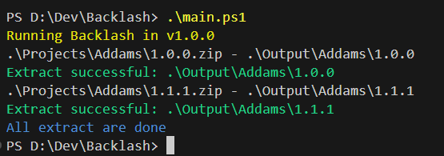

<h1 style="text-align:center;" > Backlash</h1>

[](#)  
[](https://app.codacy.com/gh/NY-Daystar/Backlash/dashboard?utm_source=gh&utm_medium=referral&utm_content=&utm_campaign=Badge_grade) [](https://opensource.org/licenses/Apache-2.0) [](https://github.com/NY-Daystar/backlash/releases)

  

   

  

Source code analysed with [Codacy](https://app.codacy.com)

## Summary

- [Requirements](#requirements)
- [User Guide](#user-guide)
- [Contact](#contact)
- [Credits](#credits)

## Requirements

- [Powershell](https://learn.microsoft.com/en-us/powershell/scripting/install/install-powershell-on-windows?view=powershell-7.5) >= 5.1

## User guide

1. Clone repository

```bash
git clone git@github.com:NY-Daystar/Backlash.git
```

2. Open Powershell terminal
3. Setup folders and files

```ps
mv Projects_Samples Projects
```

```ps
mv sources_samples.csv sources.csv
```

4. Execute this command

```ps
.\main.ps1
```

5. Your projects extracted will be found in `Output/` folder



You can activate git hooks with this command

```bash
git config --global core.hooksPath .githooks
```

### How it works

The project read the csv file in `sources.csv`.  
For each line, it will found a zip in `Projects/` folder and try to extract the zip in `Output` folder with the name and the version.

## Contact

- To make a pull request: https://github.com/NY-Daystar/backlash/pulls
- To summon an issue: https://github.com/NY-Daystar/backlash/issues
- For any specific demand by mail: [luc4snoga@gmail.com](mailto:luc4snoga@gmail.com?subject=[GitHub]%backlash%20Project)

## Credits

Made by Lucas Noga.  
Licensed under Apache.
